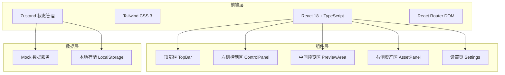
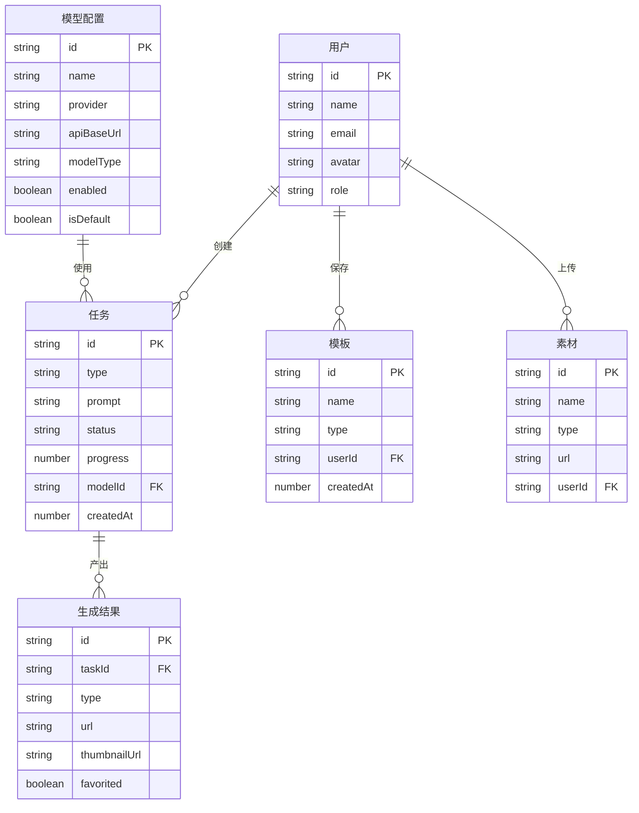

## 1. 架构设计



## 2. 技术说明

- **前端框架**：React 18 + TypeScript + Vite
- **样式方案**：Tailwind CSS 3（自定义主题变量映射品牌色）
- **状态管理**：Zustand（轻量、TypeScript 友好）
- **路由**：React Router DOM v6
- **图标库**：lucide-react
- **初始化工具**：vite-init（react-ts 模板）
- **后端**：无（纯前端，使用 Mock 数据）
- **数据库**：无（使用 LocalStorage 持久化用户数据）

## 3. 路由定义

| 路由 | 用途 |
|------|------|
| `/` | 工作台主页面（三栏布局） |
| `/settings` | 设置页面（模型配置、API 管理、账户、偏好） |

## 4. API 定义

本项目为纯前端应用，使用 Mock 数据模拟后端接口。核心数据类型定义如下：

```typescript
type TaskType = 'image' | 'video' | 'chat'
type TaskStatus = 'pending' | 'submitted' | 'queued' | 'running' | 'success' | 'failed' | 'canceled'

interface Task {
  id: string
  type: TaskType
  prompt: string
  negativePrompt: string
  params: Record<string, unknown>
  status: TaskStatus
  progress: number
  resultUrls: string[]
  createdAt: number
  updatedAt: number
  error?: string
}

type ModelType = 'chat' | 'image' | 'video' | 'multimodal'

interface ModelConfig {
  id: string
  name: string
  alias: string
  provider: string
  apiBaseUrl: string
  apiKey: string
  modelType: ModelType
  contextLength: number
  maxOutputLength: number
  capabilities: string[]
  temperature: number
  topP: number
  enabled: boolean
  isDefault: boolean
  remark: string
}

type CreationMode = 'text-to-image' | 'image-to-image' | 'text-to-video' | 'chat' | 'batch'

interface GenerationParams {
  aspectRatio: string
  resolution: string
  count: number
  duration: number
  fps: number
  orientation: string
  style: string
  creativity: number
  detail: number
  seed: number
  cfgScale: number
  steps: number
  sampler: string
  hdFix: boolean
  motionIntensity: number
  cameraMotion: string
  firstFrame: string
  lastFrame: string
}

interface Asset {
  id: string
  type: 'image' | 'video'
  url: string
  thumbnailUrl: string
  taskId: string
  createdAt: number
  favorited: boolean
  tags: string[]
}

interface Template {
  id: string
  name: string
  type: 'prompt' | 'params' | 'style'
  content: Record<string, unknown>
  createdAt: number
}
```

## 5. 服务端架构图

无后端服务，纯前端应用。

## 6. 数据模型

### 6.1 数据模型定义



### 6.2 数据定义语言

本项目使用 LocalStorage 存储数据，无 SQL DDL。数据以 JSON 格式序列化存储，键名约定：

- `agnes_tasks`：任务列表
- `agnes_models`：模型配置列表
- `agnes_assets`：资产列表
- `agnes_templates`：模板列表
- `agnes_settings`：用户偏好设置

## 7. 组件架构

### 7.1 组件目录结构

```
src/
├── components/
│   ├── topbar/
│   │   ├── TopBar.tsx
│   │   ├── ModelSelector.tsx
│   │   ├── ModeSwitch.tsx
│   │   └── UserMenu.tsx
│   ├── control/
│   │   ├── ControlPanel.tsx
│   │   ├── ModeTabs.tsx
│   │   ├── PromptInput.tsx
│   │   ├── NegativePrompt.tsx
│   │   ├── BasicSettings.tsx
│   │   ├── StyleSettings.tsx
│   │   ├── AdvancedSettings.tsx
│   │   ├── ReferenceImages.tsx
│   │   └── GenerateButton.tsx
│   ├── preview/
│   │   ├── PreviewArea.tsx
│   │   ├── TaskStatusBar.tsx
│   │   ├── ImagePreview.tsx
│   │   ├── VideoPreview.tsx
│   │   ├── ActionToolbar.tsx
│   │   ├── VersionThumbnails.tsx
│   │   ├── TaskLog.tsx
│   │   └── TaskQueue.tsx
│   ├── asset/
│   │   ├── AssetPanel.tsx
│   │   ├── RecentGenerations.tsx
│   │   ├── Favorites.tsx
│   │   ├── MaterialLibrary.tsx
│   │   ├── TemplateLibrary.tsx
│   │   └── StorageStatus.tsx
│   ├── settings/
│   │   ├── SettingsPage.tsx
│   │   ├── ModelConfigTable.tsx
│   │   ├── ModelEditor.tsx
│   │   └── ConnectivityTest.tsx
│   └── ui/
│       ├── Button.tsx
│       ├── Slider.tsx
│       ├── Select.tsx
│       ├── Chip.tsx
│       ├── Modal.tsx
│       ├── Drawer.tsx
│       ├── Toast.tsx
│       └── Progress.tsx
├── hooks/
│   ├── useTaskManager.ts
│   ├── useModelConfig.ts
│   └── useAssetManager.ts
├── pages/
│   ├── Studio.tsx
│   └── Settings.tsx
├── store/
│   ├── useAppStore.ts
│   ├── useTaskStore.ts
│   └── useModelStore.ts
├── utils/
│   ├── mockData.ts
│   └── helpers.ts
├── App.tsx
├── main.tsx
└── index.css
```

### 7.2 状态管理设计

使用 Zustand 创建以下 Store：

- **useAppStore**：全局应用状态（当前模式、侧边栏折叠状态、主题）
- **useTaskStore**：任务状态管理（任务列表、当前任务、创建/更新/删除任务、进度更新）
- **useModelStore**：模型配置管理（模型列表、当前模型、CRUD 操作、连通性测试）
